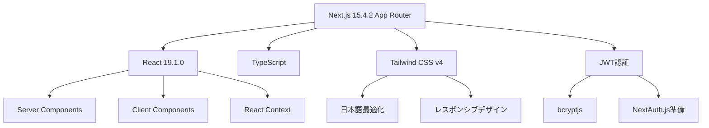
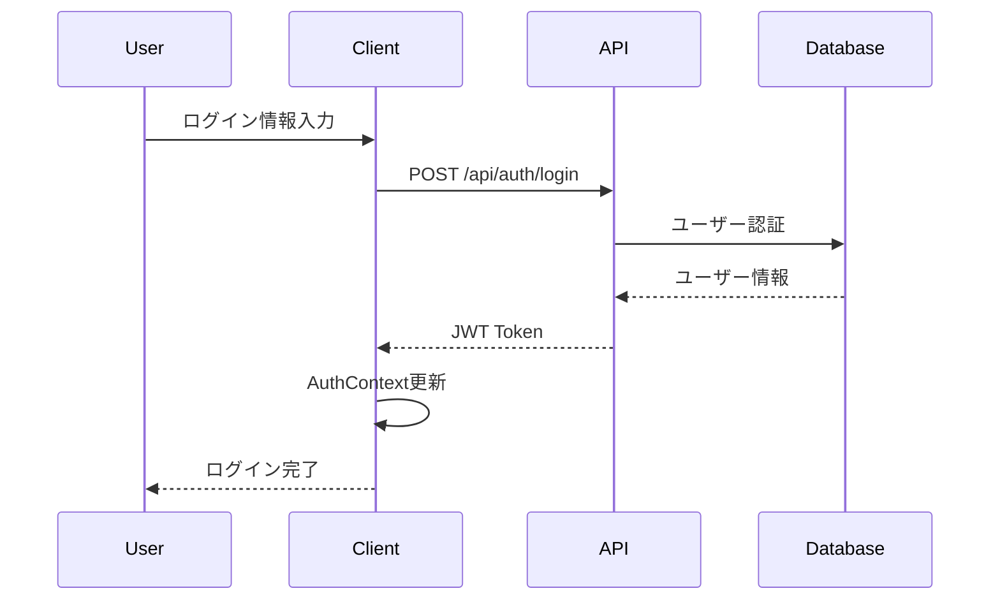
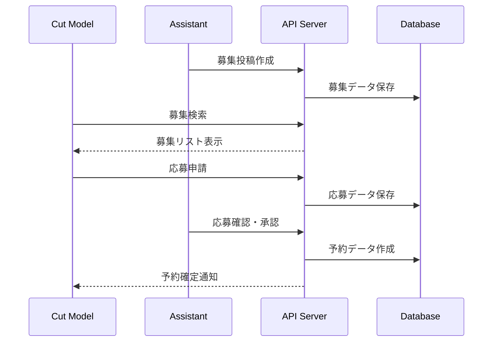

# Cutmeets - 技術アーキテクチャ仕様書

## 🏗️ システム全体構成

### 技術スタック詳細



## 📁 プロジェクト構造

### ディレクトリ構成
```
src/
├── app/                              # Next.js App Router
│   ├── (web)/                        # メインサイト（ヘッダー・フッターレイアウト）
│   │   ├── _components/              # 共通コンポーネント
│   │   │   ├── common/               # 汎用UIコンポーネント
│   │   │   │   ├── Header.tsx        # ナビゲーションヘッダー
│   │   │   │   ├── Footer.tsx        # フッター（モバイル対応）
│   │   │   │   └── FontOptimizer.tsx # フォント最適化
│   │   │   ├── client/               # クライアントサイドコンポーネント
│   │   │   │   ├── SearchInterface.tsx    # 検索インターフェース
│   │   │   │   ├── ProfileTypeSelector.tsx # プロフィール選択
│   │   │   │   └── ScheduleCalendar.tsx    # 予約カレンダー
│   │   │   ├── profile/              # プロフィール関連コンポーネント
│   │   │   │   ├── ApplicationCard.tsx     # 応募カード
│   │   │   │   ├── RecruitmentPostCard.tsx # 募集投稿カード
│   │   │   │   ├── ReviewCard.tsx          # レビューカード
│   │   │   │   ├── StatusBadge.tsx         # ステータスバッジ
│   │   │   │   ├── ActionButton.tsx        # アクションボタン
│   │   │   │   ├── TagList.tsx             # タグリスト
│   │   │   │   └── types.ts                # 型定義
│   │   │   └── providers/            # Context Providers
│   │   │       ├── AuthProvider.tsx        # 認証状態管理
│   │   │       └── BookingProvider.tsx     # 予約状態管理
│   │   ├── booking/                  # 予約管理ページ
│   │   │   ├── [assistantId]/        # アシスタント別予約
│   │   │   ├── confirmation/         # 予約確認
│   │   │   └── page.tsx              # 予約一覧
│   │   ├── catalog/                  # スタイルカタログ
│   │   │   └── ヘアスタイル/          # カテゴリ別カタログ
│   │   ├── profile/                  # プロフィール管理
│   │   │   ├── assistant/            # アシスタント用プロフィール
│   │   │   └── customer/             # カスタマー用プロフィール
│   │   ├── register/                 # ユーザー登録
│   │   ├── search/                   # 検索・募集一覧
│   │   ├── login/                    # ログインページ
│   │   ├── contact/                  # お問い合わせ
│   │   ├── help/                     # ヘルプページ
│   │   ├── favorites/                # お気に入り
│   │   ├── globals.css               # グローバルスタイル
│   │   ├── layout.tsx                # レイアウト定義
│   │   └── page.tsx                  # ランディングページ
│   ├── admin/                        # 管理者画面（別レイアウト）
│   │   ├── layout.tsx                # 管理者レイアウト
│   │   └── page.tsx                  # 管理者ダッシュボード
│   ├── assistant/                    # アシスタント専用エリア
│   └── api/                          # APIエンドポイント
│       ├── auth/                     # 認証API
│       ├── users/                    # ユーザー管理API
│       ├── bookings/                 # 予約管理API
│       └── assistants/               # アシスタント管理API
├── lib/                              # ユーティリティライブラリ
│   ├── api/                          # API関連ユーティリティ
│   │   ├── validation.ts             # Joi バリデーション
│   │   ├── auth.ts                   # 認証ヘルパー
│   │   └── mock-db.ts                # モックデータベース
│   └── utils.ts                      # 汎用ユーティリティ
└── types/                            # グローバル型定義
    ├── api.ts                        # API型定義
    ├── user.ts                       # ユーザー型定義
    └── booking.ts                    # 予約型定義
```

## 🔄 データフロー設計

### 認証フロー


### 予約フロー


## 🗄️ データモデル設計

### User（ユーザー）
```typescript
interface User {
  id: string;
  email: string;
  password: string;          // bcryptハッシュ化
  name: string;
  userType: 'stylist' | 'customer';
  profile: UserProfile;
  createdAt: Date;
  updatedAt: Date;
}

interface UserProfile {
  // 共通フィールド
  phoneNumber?: string;
  avatar?: string;
  bio?: string;
  
  // アシスタント専用
  experience?: string;       // 経験年数
  specialties?: string[];    // 得意分野
  salon?: SalonInfo;         // サロン情報
  workingHours?: TimeRange;  // 勤務時間
  availableDays?: string[];  // 勤務可能日
  
  // カスタマー専用
  preferences?: string[];    // 好みのスタイル
  hairType?: string;         // 髪質
  preferredArea?: string;    // 希望エリア
}
```

### RecruitmentPost（募集投稿）
```typescript
interface RecruitmentPost {
  id: string;
  assistantId: string;       // 投稿したアシスタントID
  title: string;             // 募集タイトル
  description: string;       // 募集内容詳細
  services: ServiceType[];   // サービス種別
  duration: number;          // 所要時間（分）
  price: number;             // 料金
  originalPrice: number;     // 通常料金
  
  // 募集条件
  requirements: string[];    // 応募条件
  modelCount: number;        // 必要人数
  appliedCount: number;      // 現在の応募数
  
  // 日程・場所
  availableDates: string[];  // 実施可能日
  availableTimes: string[];  // 時間帯
  salon: SalonInfo;          // サロン情報
  
  // ステータス
  status: 'recruiting' | 'full' | 'closed';
  urgency: 'normal' | 'urgent';
  
  createdAt: Date;
  updatedAt: Date;
}
```

### Application（応募）
```typescript
interface Application {
  id: string;
  postId: string;            // 募集投稿ID
  customerId: string;        // 応募者ID
  assistantId: string;       // アシスタントID
  
  // 応募内容
  message: string;           // 応募メッセージ
  photos: string[];          // 髪の写真
  availableTimes: string[];  // 希望時間
  
  // ステータス
  status: 'pending' | 'accepted' | 'rejected';
  reviewedAt?: Date;
  feedback?: string;         // 審査フィードバック
  
  createdAt: Date;
  updatedAt: Date;
}
```

### Booking（予約）
```typescript
interface Booking {
  id: string;
  applicationId: string;     // 元の応募ID
  customerId: string;
  assistantId: string;
  postId: string;
  
  // 予約詳細
  scheduledDate: Date;       // 予約日時
  duration: number;          // 所要時間
  services: ServiceType[];   // サービス内容
  totalPrice: number;        // 総額
  
  // 場所情報
  salon: SalonInfo;
  
  // ステータス管理
  status: 'confirmed' | 'completed' | 'cancelled' | 'no_show';
  
  // レビュー
  customerReview?: Review;   // カスタマーからのレビュー
  assistantReview?: Review;  // アシスタントからのレビュー
  
  createdAt: Date;
  updatedAt: Date;
}
```

## 🎯 コンポーネント設計原則

### 設計パターン

**1. Atomic Design適用**
```
Atoms       → Button, Input, Badge
Molecules   → SearchBox, ProfileCard
Organisms   → Header, SearchInterface
Templates   → PageLayout
Pages       → HomePage, ProfilePage
```

**2. コンポーネント分類**
```typescript
// Server Components（デフォルト）
export default function ServerComponent() {
  // サーバーサイドでのデータフェッチ
  // SEO最適化
}

// Client Components（'use client'指定）
'use client'
export default function ClientComponent() {
  // インタラクティブ機能
  // ブラウザAPI使用
}
```

**3. Props型定義**
```typescript
// 厳密な型定義でコンポーネント間の整合性を保証
interface ComponentProps {
  required: string;          // 必須プロパティ
  optional?: number;         // オプショナルプロパティ
  children?: React.ReactNode; // 子要素
  className?: string;        // スタイル拡張
  onClick?: () => void;      // イベントハンドラ
}
```

## 🔒 認証・認可アーキテクチャ

### JWT認証システム
```typescript
// トークン構造
interface JWTPayload {
  userId: string;
  userType: 'stylist' | 'customer';
  email: string;
  exp: number;              // 有効期限
  iat: number;              // 発行時刻
}

// 認証ミドルウェア
export function withAuth(handler: ApiHandler) {
  return async (req: NextRequest) => {
    const token = req.headers.get('authorization')?.replace('Bearer ', '');
    
    if (!token) {
      return NextResponse.json({ error: 'Unauthorized' }, { status: 401 });
    }
    
    try {
      const payload = jwt.verify(token, process.env.JWT_SECRET!) as JWTPayload;
      req.user = payload;
      return handler(req);
    } catch (error) {
      return NextResponse.json({ error: 'Invalid token' }, { status: 401 });
    }
  };
}
```

### 認可レベル
```typescript
enum Permission {
  // 一般ユーザー
  VIEW_PUBLIC = 'view:public',
  VIEW_OWN_PROFILE = 'view:own_profile',
  EDIT_OWN_PROFILE = 'edit:own_profile',
  
  // カスタマー
  APPLY_TO_POSTS = 'apply:posts',
  VIEW_BOOKINGS = 'view:bookings',
  LEAVE_REVIEWS = 'leave:reviews',
  
  // アシスタント
  CREATE_POSTS = 'create:posts',
  MANAGE_APPLICATIONS = 'manage:applications',
  VIEW_CUSTOMER_INFO = 'view:customer_info',
  
  // 管理者
  VIEW_ALL_USERS = 'view:all_users',
  MODERATE_CONTENT = 'moderate:content',
  VIEW_ANALYTICS = 'view:analytics'
}
```

## 🎨 スタイリングアーキテクチャ

### Tailwind CSS設定
```javascript
// tailwind.config.js
module.exports = {
  content: ['./src/**/*.{js,ts,jsx,tsx,mdx}'],
  theme: {
    extend: {
      fontFamily: {
        sans: ['var(--font-noto-sans-jp)', 'var(--font-geist-sans)', 'system-ui'],
      },
      colors: {
        primary: {
          50: '#fdf2f8',
          500: '#ec4899',
          600: '#db2777',
          900: '#831843',
        },
      },
      spacing: {
        '18': '4.5rem',
        '88': '22rem',
      },
    },
  },
  plugins: [],
}
```

### CSS Variables
```css
:root {
  /* カラーシステム */
  --color-primary: #ec4899;
  --color-secondary: #8b5cf6;
  --color-success: #10b981;
  --color-warning: #f59e0b;
  --color-error: #ef4444;
  
  /* フォントシステム */
  --font-sans: var(--font-noto-sans-jp), var(--font-geist-sans);
  --font-mono: var(--font-geist-mono);
  
  /* スペーシング */
  --space-xs: 0.25rem;
  --space-sm: 0.5rem;
  --space-md: 1rem;
  --space-lg: 1.5rem;
  --space-xl: 3rem;
}
```

### 日本語テキスト最適化
```css
/* 日本語テキスト基本設定 */
.text-ja {
  word-break: keep-all;
  overflow-wrap: break-word;
  line-break: strict;
  font-feature-settings: "palt" 1, "pkna" 1;
  text-spacing: trim-start;
}

/* 文字間隔バリエーション */
.text-ja-tight    { letter-spacing: 0.01em; }
.text-ja-normal   { letter-spacing: 0.025em; }
.text-ja-relaxed  { letter-spacing: 0.04em; }

/* レスポンシブ対応 */
@media (max-width: 640px) {
  .text-ja-mobile { letter-spacing: 0.035em; }
}
```

## 📊 パフォーマンス最適化

### フォント最適化戦略
```typescript
// layout.tsx
import { Noto_Sans_JP, Geist } from 'next/font/google';

const notoSansJP = Noto_Sans_JP({
  variable: '--font-noto-sans-jp',
  subsets: ['latin'],
  display: 'swap',           // フォントローディング戦略
  weight: ['300', '400', '500', '600', '700'],
  preload: true,             // 重要フォントのプリロード
});

const geistSans = Geist({
  variable: '--font-geist-sans',
  subsets: ['latin'],
  display: 'swap',
  adjustFontFallback: true,  // CLS削減
  preload: true,
});
```

### 画像最適化
```typescript
// Next.js Image component使用
import Image from 'next/image';

<Image
  src="/hero-image.jpg"
  alt="Hero background"
  width={1920}
  height={1080}
  priority              // LCP最適化
  placeholder="blur"    // ローディング体験向上
  sizes="100vw"        // レスポンシブ対応
/>
```

### コード分割
```typescript
// 動的インポートでバンドルサイズ最適化
const SearchInterface = dynamic(
  () => import('./SearchInterface'),
  { 
    loading: () => <SearchSkeleton />,
    ssr: false  // クライアントサイドのみ必要な場合
  }
);
```

## 🧪 テスト戦略

### テスト構成
```
tests/
├── __tests__/           # 単体テスト
│   ├── components/      # コンポーネントテスト
│   ├── pages/          # ページテスト
│   └── api/            # APIテスト
├── e2e/                # E2Eテスト
├── fixtures/           # テストデータ
└── utils/              # テストユーティリティ
```

### テストツール
- **Jest**: 単体テスト・統合テスト
- **React Testing Library**: コンポーネントテスト
- **Playwright**: E2Eテスト
- **MSW**: API モック

## 🚀 デプロイメント構成

### 環境分離
```
Development  → localhost:3000
Staging      → staging.cutmeets.com
Production   → cutmeets.com
```

### CI/CD パイプライン
```yaml
# .github/workflows/deploy.yml
name: Deploy
on:
  push:
    branches: [main]

jobs:
  test:
    runs-on: ubuntu-latest
    steps:
      - uses: actions/checkout@v3
      - name: Setup Node.js
        uses: actions/setup-node@v3
        with:
          node-version: '18'
      - run: npm ci
      - run: npm run lint
      - run: npm run test
      - run: npm run build

  deploy:
    needs: test
    runs-on: ubuntu-latest
    steps:
      - name: Deploy to Vercel
        uses: amondnet/vercel-action@v25
```

---

この技術アーキテクチャにより、Cutmeetsは拡張性・保守性・パフォーマンスを兼ね備えた堅牢なプラットフォームとして構築されています。