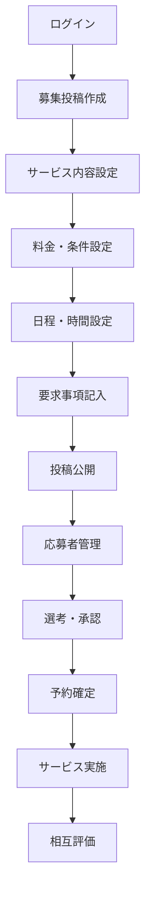
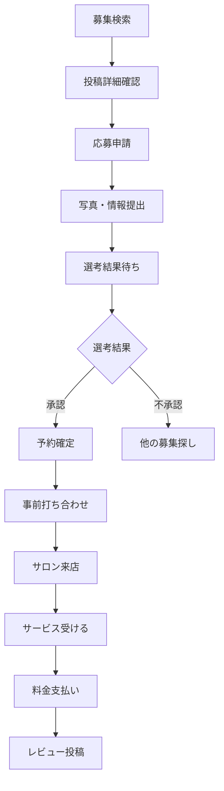
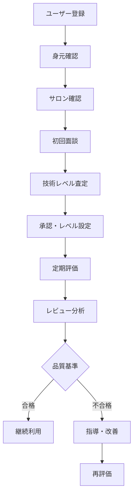

# Cutmeets - ビジネスロジック・業務仕様書

## 🎯 プラットフォーム概要

**Cutmeets**は、アシスタント美容師と一般利用者を結ぶカットモデルマッチングプラットフォームです。アシスタント美容師の技術向上支援と、利用者への格安美容サービス提供を両立させるWin-Winモデルを実現します。

## 💡 ビジネスモデル

### 基本構造
```
アシスタント美容師 ←→ プラットフォーム ←→ カットモデル
    ↑ 技術向上        ↑ 仲介手数料      ↑ 格安サービス
    ↑ 経験積み重ね    ↑ 品質保証        ↑ 安全な体験
```

### 収益構造
1. **手数料収入**（プライマリー）
   - カットモデルが支払う料金の15-20%を仲介手数料として徴収
   - 支払い決済手数料（3-5%）

2. **プレミアム機能**（セカンダリー）
   - アシスタント美容師向け有料プラン
   - 優先表示・高度な検索機能

3. **サロンパートナーシップ**（将来展開）
   - サロンへの求人紹介手数料
   - 研修プログラム・教材販売

## 👥 ユーザータイプ・ペルソナ

### 🎨 アシスタント美容師
**プライマリーペルソナ：技術向上を目指す新人〜中堅アシスタント**

#### 基本属性
- **年齢**: 20-30歳
- **経験年数**: 0.5-5年
- **勤務形態**: 正社員・アルバイト
- **月収**: 15-25万円
- **居住地**: 首都圏・関西圏の主要都市

#### 課題・ニーズ
- **技術向上機会の不足**: サロンでの練習機会が限定的
- **経験値蓄積**: 様々な髪質・スタイルでの実践経験が必要
- **キャリアアップ**: スタイリストになるための実績作り
- **収入補完**: アルバイト代感覚での小遣い稼ぎ

#### 利用動機
- 低リスクでの技術練習
- ポートフォリオ作成
- 顧客対応スキル向上
- 空いた時間の有効活用

### 👤 カットモデル（一般利用者）
**プライマリーペルソナ：美容に興味があるコスト意識の高い20-40代女性**

#### 基本属性
- **年齢**: 20-40歳（中心：25-35歳）
- **性別**: 女性80%、男性20%
- **職業**: 会社員、学生、主婦
- **世帯年収**: 300-600万円
- **居住地**: 都市部・郊外

#### 課題・ニーズ
- **美容費の節約**: 通常の1/2-1/3価格でのサービス利用
- **新しいスタイルへの挑戦**: 低リスクでイメージチェンジ
- **社会貢献**: アシスタント美容師の成長支援への参加意識
- **利便性**: 予約の取りやすさ・アクセスの良さ

#### 利用動機
- 格安での美容サービス体験
- 新しいスタイルへの挑戦
- 若手美容師の応援
- 特別感のある体験

## 🔄 主要業務フロー

### 1. アシスタント美容師の募集投稿フロー


### 2. カットモデルの応募〜利用フロー


### 3. 品質管理・安全確保フロー


## 📊 料金体系・価格設定

### アシスタント美容師の料金設定
```
通常サロン価格の 40-60% で設定
（プラットフォーム手数料：15-20%を差し引いた金額が収入）

例：
- カット（通常¥4,000）→ 募集価格¥2,000 → アシスタント収入¥1,600
- カラー（通常¥8,000）→ 募集価格¥4,000 → アシスタント収入¥3,200
- カット+カラー（通常¥12,000）→ 募集価格¥6,000 → アシスタント収入¥4,800
```

### サービス別標準料金
| サービス | 通常価格 | プラットフォーム価格 | アシスタント収入 |
|----------|----------|-------------------|-----------------|
| カット | ¥3,000-5,000 | ¥1,500-2,500 | ¥1,200-2,000 |
| カラー | ¥6,000-10,000 | ¥3,000-5,000 | ¥2,400-4,000 |
| パーマ | ¥8,000-12,000 | ¥4,000-6,000 | ¥3,200-4,800 |
| トリートメント | ¥3,000-5,000 | ¥1,500-2,500 | ¥1,200-2,000 |
| ストレート | ¥10,000-15,000 | ¥5,000-7,500 | ¥4,000-6,000 |

## 🛡️ 品質保証・安全管理

### アシスタント美容師の認証制度
#### レベル分類
1. **研修生レベル（★☆☆）**
   - 美容師免許取得後6ヶ月未満
   - 基本的なカットのみ可能
   - ベテランスタイリストの監督必須

2. **初級レベル（★★☆）**
   - 美容師免許取得後6ヶ月〜2年
   - カット・基本カラー可能
   - 定期的な技術チェック

3. **中級レベル（★★★）**
   - 美容師免許取得後2年以上
   - 全サービス対応可能
   - 高度な技術習得済み

#### 技術査定基準
- **基本技術**: シャンプー、ブロー、基本カット
- **応用技術**: レイヤーカット、グラデーションカット
- **専門技術**: カラーリング、パーマ技術
- **接客スキル**: コミュニケーション、カウンセリング能力

### カットモデルの安全保護
#### 事前確認事項
- **健康状態**: アレルギー、頭皮トラブルの確認
- **希望スタイル**: 詳細な要望ヒアリング
- **リスク説明**: 技術練習であることの十分な説明
- **同意確認**: 書面での同意書取得

#### 補償制度
- **技術保険**: 施術ミス時の修正・補償
- **医療保険**: アレルギー等の医療費補償
- **満足保証**: 不満足時の返金・再施術保証

## 📈 KPI・成功指標

### プラットフォーム全体KPI
1. **ユーザー数**
   - 月間アクティブユーザー数（MAU）
   - 新規登録ユーザー数
   - ユーザー継続率

2. **マッチング成功率**
   - 投稿から成約までのコンバージョン率
   - 応募から承認までの成功率
   - リピート利用率

3. **収益指標**
   - 月間総取引額（GMV）
   - プラットフォーム手数料収入
   - ユーザー単価（ARPU）

### アシスタント美容師向けKPI
- **技術向上指標**: レビュー評価平均、技術レベル向上率
- **経験蓄積**: 施術経験数、多様性スコア
- **収入指標**: 月間平均収入、時給換算

### カットモデル向けKPI
- **満足度指標**: サービス満足度、リピート意向
- **節約効果**: 通常価格との差額、年間節約金額
- **利用頻度**: 月間利用回数、年間利用金額

## 🔄 季節性・需要変動対応

### 需要ピーク時期
- **春（3-5月）**: 新生活・就職活動でのイメージチェンジ需要
- **夏（6-8月）**: 夏休み・夏スタイルへの変更需要
- **秋（9-11月）**: 季節の変わり目・結婚式シーズン
- **年末年始（12-1月）**: 新年・成人式需要

### 需要変動対策
1. **価格調整**: 需要に応じた動的価格設定
2. **キャンペーン**: 閑散期の需要喚起施策
3. **サービス拡張**: 季節限定メニューの提供
4. **マーケティング**: ターゲットを絞った促進策

## 🎯 競合分析・差別化戦略

### 直接競合
1. **従来美容サロン**
   - 価格面での優位性（50-60%安）
   - 新しい体験価値の提供

2. **美容マッチングアプリ**
   - 品質保証の徹底
   - 安全性の確保

3. **美容専門学校の練習モデル**
   - 利便性・アクセスの良さ
   - 料金体系の透明性

### 差別化ポイント
1. **三方よしのビジネスモデル**
   - アシスタント：技術向上機会
   - カットモデル：格安サービス
   - サロン：人材育成支援

2. **徹底した品質管理**
   - 段階的な技術認証制度
   - 充実した保険・補償制度

3. **ユーザー体験の最適化**
   - 直感的なUI/UX
   - 日本語に最適化されたデザイン

## 📋 リスク管理・コンプライアンス

### 主要リスクと対策
#### 技術・安全リスク
- **リスク**: 技術不足による施術ミス
- **対策**: 段階的認証制度・保険制度・教育プログラム

#### 法的リスク
- **リスク**: 美容師法違反・消費者保護法違反
- **対策**: 法的コンプライアンス体制・弁護士監修

#### 評判・ブランドリスク
- **リスク**: 事故・トラブルによる評判悪化
- **対策**: 危機管理体制・迅速な対応システム

### コンプライアンス体制
1. **美容師法遵守**: 免許確認・適法性確保
2. **個人情報保護**: GDPR準拠・データセキュリティ
3. **消費者保護**: 適切な情報開示・契約条件明示
4. **労働法遵守**: 適正な報酬・労働条件確保

## 🚀 将来展開・拡張計画

### フェーズ1（現在）：基盤構築
- 首都圏でのサービス開始
- 基本機能の実装・運用
- ユーザー獲得・品質向上

### フェーズ2（6ヶ月後）：機能拡張
- 決済システム実装
- レビュー・評価システム強化
- モバイルアプリ開発

### フェーズ3（1年後）：地域展開
- 関西圏・中部圏への展開
- サロンパートナーシップ拡大
- AI マッチング機能導入

### フェーズ4（2年後）：事業多角化
- 美容師求人事業
- 美容教育・研修事業
- 美容商品販売事業

---

このビジネスロジックにより、Cutmeetsは持続可能で社会価値の高いプラットフォームとして、美容業界の新しいエコシステムを構築します。